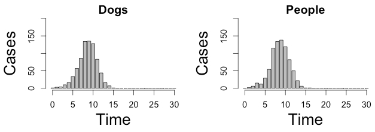
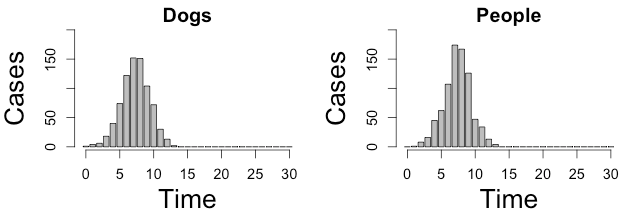
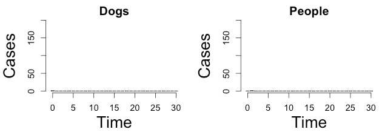
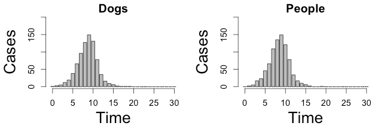

# Part 1: Epidemic dynamics

A disease called Dynamical Fever (DF) causes near-annual outbreaks in dogs and people in Daidd County. Typical outbreaks produce similar patterns of cases in the two populations, and the outbreaks always occur simultaneously. DF became a reportable disease in Daidd County in 2009, and the Department of Health has enlisted your help to understand the data they have collected since that time.

In 2008 and 2009 the outbreaks looked pretty similar. First, look at how the epidemics in dogs and people progressed in 2009:

### 2009
 

The x-axis is time (week of the year), and the y-axis is the number of new cases observed.  Overall, there were 759 canine cases and 786 human cases over a period of 16 weeks. In 2010, there were 789 canine cases and 804 human cases, and the outbreak lasted 14 weeks. You can see that the overall pattern of these outbreaks was similar by comparing the epidemic curves:

### 2010

In 2011, there was only one case in dogs and one in humans, but in 2012, another large outbreak occurred, with a total of 796 canine cases and 821 human cases over a period of 20 weeks.

### 2011

### 2012

Based on the data from 2009-2012, what have you learned about DF?  What factors might determine the differences in epidemic size and duration from year to year? Is it possible to draw any conclusions about the natural history of the disease? Why might the epidemic die out each spring?
