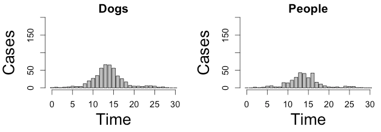
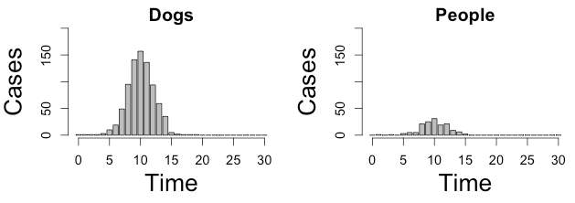

# Part 3: Introduction of a human vaccine

Luckily for the Director of the Health Department, the approval of a human vaccine against DF in mid-2014 meant that he did not have to take a strong stance on the debate over dog vaccination. Instead, he simply redirected funds from the earlier information campaign on dog vaccination to promote human vaccination. By the beginning of 2015, 50 percent of the people in Daidd County had been vaccinated, though dog vaccine uptake fell to 20 percent.

Although the 2015 season got off to a slow start, the Director was in for a surprise when the outbreak picked up later in the season. In the end, the 2015 outbreak was the worst one for years, with 480 canine cases and 315 human cases over a period of 29 weeks:

### 2015

By mid-June, the Director had had enough and decided step down in order to spend more time with his family and their dogs. His former Deputy was quickly appointed to be the Health Department's Acting Director, and she worked doggedly over the next few months to ensure that as many people in the community were vaccinated in time for the 2016 season as possible. By the beginning of the year, 80 percent of the people in Daidd County had been vaccinated. In the meantime, a contamination scare temporarily disrupted the availablility of the dog vaccine. The Acting Director had never been convinced that the dog vaccine had caused the reduction in dog or human DF cases following its introduction, believing instead that a new, less transmissible strain had probably been introduced around the same time as the canine vaccine. She was therefore surprised to see so many canine cases in Daidd County in 2016:

### 2016

In fact, there were more cases of DF in dogs in 2016 than in any year on record, with 812 canine cases, though there were only 149 human cases. As a dog lover, the AD is distraught, and it is at this point that she decides she needs outside expertise and brings you in as a consultant.

*Having reviewed all of the data available to you, what potential DF transmission patterns could explain all of the observed data? What would you advise the AD to do in order to prepare for the 2017 DF season?*
